# SLTB SafeTrack AI — Comprehensive Implementation Plan

## Overview
The **SLTB SafeTrack AI** application is an IoT- and AI-Based Smart Traffic Monitoring and Accident Prevention Web Application for the Sri Lanka Transport Board. This plan outlines the technical architecture, domain modeling, algorithmic choices, validation rules, and Phase 1 execution details following strict 3-tier architecture, pure CSS3 styling (no frameworks), Python Flask REST API & WebSockets, MySQL database persistence, and comprehensive OOP/DSA principles.

---

## 1. Existing Database Mapping Plan
We will map all 16 existing MySQL tables in `safe_track_ai_db` directly into declarative SQLAlchemy models without altering the table structure, column names, or foreign key constraints defined in `safe_track_ai_db (3).sql`.

| Database Table | SQLAlchemy Model Class | Primary Key | Key Foreign Keys & Relationships |
|---|---|---|---|
| `roles` | `RoleModel` | `role_id` | `users` (1-to-many) |
| `users` | `UserModel` | `user_id` | `role_id` -> `roles`, `sltb_users`, `police_officers`, `user_sessions`, `user_activity_logs` |
| `sltb_users` | `SLTBUserModel` | `sltb_user_id` | `user_id` -> `users` |
| `police_officers` | `PoliceOfficerModel` | `officer_id` | `user_id` -> `users` |
| `buses` | `BusModel` | `bus_id` | `bus_assignments`, `bus_devices`, `sensor_data`, `bus_alerts`, `accident_reports` |
| `drivers` | `DriverModel` | `driver_id` | `bus_assignments`, `accident_reports` |
| `routes` | `RouteModel` | `route_id` | `bus_assignments`, `roadside_units`, `roadside_alerts`, `accident_reports` |
| `bus_assignments` | `BusAssignmentModel` | `assignment_id` | `bus_id` -> `buses`, `driver_id` -> `drivers`, `route_id` -> `routes` |
| `device_registry` | `DeviceRegistryModel` | `device_id` | `bus_devices`, `roadside_units`, `sensor_data`, `bus_alerts`, `roadside_alerts` |
| `bus_devices` | `BusDeviceModel` | `bus_device_id` | `bus_id` -> `buses`, `device_id` -> `device_registry` |
| `roadside_units` | `RoadsideUnitModel` | `roadside_unit_id` | `device_id` -> `device_registry`, `route_id` -> `routes` |
| `sensor_data` | `SensorDataModel` | `sensor_data_id` | `device_id` -> `device_registry`, `bus_id` -> `buses`, `roadside_unit_id` -> `roadside_units` |
| `bus_alerts` | `BusAlertModel` | `bus_alert_id` | `bus_id`, `device_id`, `assignment_id`, `sensor_data_id` |
| `roadside_alerts` | `RoadsideAlertModel` | `roadside_alert_id` | `roadside_unit_id`, `device_id`, `route_id`, `sensor_data_id` |
| `accident_reports` | `AccidentReportModel` | `accident_id` | `bus_id`, `route_id`, `driver_id`, `created_by` |
| `notifications` | `NotificationModel` | `notification_id` | `notification_recipients` |
| `notification_recipients` | `NotificationRecipientModel` | `recipient_id` | `notification_id`, `officer_id` |
| `user_sessions` | `UserSessionModel` | `session_id` | `user_id` -> `users` |
| `user_activity_logs` | `UserActivityLogModel` | `activity_id` | `user_id` -> `users` |
| `system_settings` | `SystemSettingModel` | `setting_id` | None |

---

## 2. Sensor Speed-Column Mapping Plan
The `sensor_data` table contains three speed columns:
- `front_approach_speed_kmh` `DECIMAL(6,2)` NULL
- `right_approach_speed_kmh` `DECIMAL(6,2)` NULL
- `left_approach_speed_kmh` `DECIMAL(6,2)` NULL

### Execution & Mapping Guidelines:
- **No Schema Mutations**: We will NOT execute any `ALTER TABLE` commands.
- **SQLAlchemy Property Mapping**: Mapped as `Column(Numeric(6, 2), nullable=True)` inside `SensorDataModel` and domain `SensorData` class.
- **Validation Rules**:
  - Null values permitted when sensor readings are absent.
  - Reject negative values (`speed < 0`).
  - Reject non-numeric types.
- **Serialization & Reporting**: Formatted to 2 decimal places in approach speed reports and WebSocket push payloads (`approach_speed_updated`).

---

## 3. Sidebar Plan (With Reports Module)
The navigation sidebar will follow the exact order requested:
1. **Home Dashboard** (`/sltb/dashboard`) — `LayoutDashboard` icon
2. **Bus Management** (`/sltb/buses`) — `Bus` icon
3. **Driver Management** (`/sltb/drivers`) — `UserCheck` icon
4. **Route Management** (`/sltb/routes`) — `GitFork` icon
5. **Reports** (`/sltb/reports`) — `FileBarChart` / `FileText` icon (positioned directly below Route Management & above Profile)
6. **Profile** (`/sltb/profile`) — `User` icon
7. **Settings** (`/sltb/settings`) — `Settings` icon
8. **Logout** — `LogOut` icon

### Features & Styling:
- Active route highlighting using CSS variables (`--color-primary`, `--color-primary-light`).
- Responsive sliding overlay collapsible menu for mobile viewports (`< 768px`).
- Logout triggers clean WebSocket disconnection, session termination API call, and client state teardown.

---

## 4. Reports Page & Approach Speed Report Plan
Dynamic analytics engine operating over existing MySQL entities without creating synthetic database tables.

### Report Categories:
1. **Bus Performance Report**: Status breakdown, assigned route history, warning alerts summary.
2. **Driver Performance Report**: Total trips, safe operating score, assigned routes.
3. **Route Performance Report**: Fleet allocation per route, incident density.
4. **Bus Alert Report**: Forward collision, human/animal detection, headlight reminders.
5. **Roadside Alert Report**: Unsafe U-turn violations, roadside sensor detections.
6. **Accident Summary Report**: Historical incident severity distribution.
7. **Approach Speed Analysis Report**: Aggregated analysis of front, left, and right approach speeds recorded by ESP32 units.

### Filter Parameters:
- `report_type` (Enum string)
- `start_date`, `end_date` (ISO Date)
- `status` (Enum string)
- `device_id` / `bus_id` (Integer filtering)
- `search` (Query keyword)
- `sort_by` & `order` (`asc` / `desc`)

---

## 5. Strict Three-Tier Architecture Plan

```
   ┌──────────────────────────────────────────────────────────┐
   │             TIER 1: PRESENTATION LAYER                   │
   │   React JSX Components, Custom CSS3, Client Validation   │
   └────────────────────────────┬─────────────────────────────┘
                                │ HTTP REST / WebSocket
   ┌────────────────────────────▼─────────────────────────────┐
   │             TIER 2: BUSINESS LOGIC LAYER                 │
   │   Flask Controllers, Business Services, OOP Domains,     │
   │   DSA Strategy Engine (Search/Sort), BaseValidators      │
   └────────────────────────────┬─────────────────────────────┘
                                │ SQLAlchemy ORM / Transactions
   ┌────────────────────────────▼─────────────────────────────┐
   │              TIER 3: DATA ACCESS LAYER                   │
   │   Concrete Repositories (UserRepository, BusRepo...),   │
   │   SQLAlchemy Models, MySQL Persistence (safe_track_ai_db)│
   └──────────────────────────────────────────────────────────┘
```

- **Tier 1 (Presentation)**: Pure React.js components using custom CSS variables. Zero SQL or ORM calls.
- **Tier 2 (Logic)**: Thin Flask controllers routing requests to Service instances (`DashboardService`, `ReportService`, etc.). Custom validators enforcing business logic and custom manual search/sort strategies executing in memory.
- **Tier 3 (Data Access)**: Controlled repository classes inheriting from `BaseRepository`, managing DB sessions, handling explicit unit-of-work commits and rollbacks.

---

## 6. OOP Class Design & Core Principles

### 6.1 Encapsulation
Domain models encapsulate state with protected instance attributes (`_attribute`) and `@property` getters/setters with strict validation:
- `SystemUser`: `_user_id`, `_username`, `_email`, `_password_hash`, `_status`, `_role`
- `Bus`: `_bus_id`, `_registration_number`, `_bus_number`, `_capacity`, `_status` (Capacity > 0)
- `Driver`: `_driver_id`, `_full_name`, `_license_number`, `_experience_years`, `_status` (Experience >= 0)
- `Route`: `_route_id`, `_route_number`, `_distance_km`, `_status` (Distance >= 0)
- `SensorData`: `_front_approach_speed_kmh`, `_right_approach_speed_kmh`, `_left_approach_speed_kmh` (Speed >= 0 or NULL)

### 6.2 Abstraction
Using `abc.ABC` and `@abstractmethod`:
- `BaseRepository`: Abstract contracts `get_by_id`, `get_all`, `create`, `update`, `delete`
- `BaseValidator`: Abstract contract `validate(data)`
- `BaseAuthenticationService`: Abstract contract `authenticate(identifier, password)`, `authorize_role(user)`
- `SearchStrategy`: Abstract contract `search(items, query, field)`
- `SortStrategy`: Abstract contract `sort(items, key, order)`

### 6.3 Inheritance
- Domain Inheritance: `SLTBAdmin` inherits from `SystemUser`
- Repository Inheritance: `UserRepository`, `BusRepository`, `DriverRepository`, `RouteRepository`, `SensorDataRepository`, `DashboardRepository`, `ReportRepository` inherit from `BaseRepository`
- Validator Inheritance: `LoginValidator`, `ForgotPasswordValidator`, `ResetPasswordValidator`, `SearchValidator`, `ReportFilterValidator`, `SensorDataValidator` inherit from `BaseValidator`
- Algorithm Inheritance: `LinearSearchStrategy` & `BinarySearchStrategy` inherit from `SearchStrategy`; `MergeSortStrategy` & `QuickSortStrategy` inherit from `SortStrategy`

### 6.4 Polymorphism
Service components consume generic parent abstract interfaces (`SearchStrategy`, `SortStrategy`, `BaseRepository`) without relying on concrete implementations.

### 6.5 Method Overriding
All concrete subclasses explicitly override parent methods (e.g., `validate()`, `search()`, `sort()`, `get_all()`).

### 6.6 Method Overloading via `functools.singledispatchmethod`
Used in `GlobalSearchService.search()`:
- `str` -> Text search
- `int` -> Numerical ID exact match
- `SearchCriteria` -> Complex criteria search

---

## 7. Frontend & Backend Validation Plan

- **Frontend Validation**:
  - React Hook Form paired with Zod schemas (`authSchemas.js`, `searchSchemas.js`, `reportSchemas.js`).
  - Inline error rendering, auto-trimming, submit prevention.
- **Backend Validation**:
  - Concrete `BaseValidator` subclasses (`LoginValidator`, `ReportFilterValidator`, etc.).
  - Returning standardized HTTP 400 response payload:
    ```json
    {
      "success": false,
      "message": "Validation failed.",
      "errors": {
        "field_name": "Error description."
      }
    }
    ```

---

## 8. Python Error-Handling Plan
- Structural `try...except...finally` blocks wrapping DB transactions, authentication steps, and service queries.
- Exception mapping:
  - `SQLAlchemyError`, `IntegrityError` -> Rollback transaction, safe HTTP 500/409 error.
  - `ValidationError` -> HTTP 400.
  - `InvalidCredentialsError`, `UnauthorizedRoleError` -> HTTP 401/403.
  - Internal tracebacks logged strictly to server stdout/logger, masked from client responses.

---

## 9. JavaScript Error-Handling Plan
- Async methods wrapped in `try...catch...finally`.
- Axios response interceptors for global token handling and expired session redirects (HTTP 401 -> `/login`).
- Top-level React `ErrorBoundary` component preventing complete app breakdown on component failure.

---

## 10. Manual Search Algorithms Plan

### 10.1 Binary Search (`BinarySearchStrategy`)
- **Use Case**: Exact lookup on sorted collections (e.g., Bus registration number, Route number, exact IDs).
- **Complexity**: $O(\log n)$ time. Manual array pivoting without `bisect`.

### 10.2 Linear Search (`LinearSearchStrategy`)
- **Use Case**: Partial text searching (Driver name, Depot, Start/End location).
- **Complexity**: $O(n)$ time. Manual case-insensitive substring checks across list items.

---

## 11. Manual Sorting Algorithms Plan

### 11.1 Merge Sort (`MergeSortStrategy`)
- **Use Case**: Stable sorting of Recent Activities by timestamp and dataset preparation before search operations.
- **Complexity**: $O(n \log n)$ time complexity guaranteed.

### 11.2 Quick Sort (`QuickSortStrategy`)
- **Use Case**: In-place sorting of Latest Registered Buses, Driver lists, and Route lists.
- **Complexity**: Average $O(n \log n)$ time complexity.

---

## 12. REST API Endpoints Plan

| HTTP Method | Endpoint | Description | Auth Required |
|---|---|---|---|
| `GET` | `/api/v1/health` | System health check | Public |
| `GET` | `/api/v1/public/statistics` | Public stats for Splash/Login | Public |
| `POST` | `/api/v1/auth/login` | Authenticate SLTB Admin | Public |
| `GET` | `/api/v1/auth/session` | Validate current session token | Private |
| `POST` | `/api/v1/auth/logout` | Terminate session | Private |
| `POST` | `/api/v1/auth/forgot-password` | Request password reset token | Public |
| `POST` | `/api/v1/auth/reset-password` | Perform password reset | Public |
| `GET` | `/api/v1/sltb/dashboard` | Main SLTB Dashboard summary | SLTB Admin |
| `GET` | `/api/v1/sltb/dashboard/summary` | Summary cards stats | SLTB Admin |
| `GET` | `/api/v1/sltb/dashboard/bus-status` | Bus status breakdown | SLTB Admin |
| `GET` | `/api/v1/sltb/dashboard/driver-status` | Driver status breakdown | SLTB Admin |
| `GET` | `/api/v1/sltb/dashboard/fleet-overview` | Fleet assignments stats | SLTB Admin |
| `GET` | `/api/v1/sltb/dashboard/recent-activities` | Recent logs sorted via MergeSort | SLTB Admin |
| `GET` | `/api/v1/sltb/dashboard/latest-buses` | Latest buses sorted via QuickSort | SLTB Admin |
| `GET` | `/api/v1/sltb/dashboard/route-distribution` | Active routes distribution | SLTB Admin |
| `GET` | `/api/v1/sltb/search` | Dynamic global search engine | SLTB Admin |
| `GET` | `/api/v1/sltb/reports` | Comprehensive filtered report engine | SLTB Admin |

---

## 13. WebSocket Plan

- Built using **Flask-SocketIO**.
- Authentication handshake validates JWT / session token and enforces `SLTB Admin` role.
- Authorized sockets automatically join the `sltb_admin` room.
- Events emitted: `dashboard_summary_updated`, `bus_status_updated`, `driver_status_updated`, `approach_speed_updated`, `sensor_data_updated`.

---

## 14. Frontend Folder Structure (React.js, HTML5, CSS3)

```
frontend/
├── index.html
├── package.json
├── vite.config.js
├── src/
│   ├── main.jsx
│   ├── App.jsx
│   ├── assets/
│   │   ├── images/
│   │   └── icons/
│   ├── components/
│   │   ├── auth/
│   │   ├── common/
│   │   ├── dashboard/
│   │   ├── layout/
│   │   └── reports/
│   ├── contexts/
│   │   └── AuthContext.jsx
│   ├── hooks/
│   │   ├── useAuth.js
│   │   ├── useDashboardSocket.js
│   │   └── useDebounce.js
│   ├── pages/
│   │   ├── SplashPage.jsx
│   │   ├── LoginPage.jsx
│   │   ├── ForgotPasswordPage.jsx
│   │   ├── ResetPasswordPage.jsx
│   │   ├── SLTBDashboardPage.jsx
│   │   ├── ReportsPage.jsx
│   │   ├── ModulePlaceholderPage.jsx
│   │   ├── UnauthorizedPage.jsx
│   │   └── NotFoundPage.jsx
│   ├── schemas/
│   │   ├── authSchemas.js
│   │   ├── searchSchemas.js
│   │   └── reportSchemas.js
│   ├── services/
│   │   ├── apiClient.js
│   │   ├── authService.js
│   │   ├── dashboardService.js
│   │   ├── reportService.js
│   │   ├── searchService.js
│   │   └── socketService.js
│   ├── styles/
│   │   ├── variables.css
│   │   ├── global.css
│   │   ├── splash.css
│   │   ├── auth.css
│   │   ├── dashboard.css
│   │   ├── reports.css
│   │   └── responsive.css
│   └── utils/
│       ├── dateFormatter.js
│       └── errorFormatter.js
```

---

## 15. Backend Folder Structure (Python Flask 3-Tier)

```
backend/
├── run.py
├── requirements.txt
├── .env.example
└── app/
    ├── __init__.py
    ├── config.py
    ├── presentation/
    │   ├── controllers/
    │   │   ├── auth_controller.py
    │   │   ├── dashboard_controller.py
    │   │   ├── public_controller.py
    │   │   ├── report_controller.py
    │   │   └── search_controller.py
    │   ├── websocket/
    │   │   ├── dashboard_socket.py
    │   │   └── sensor_socket.py
    │   ├── error_handlers.py
    │   └── response_factory.py
    ├── business/
    │   ├── services/
    │   │   ├── base_authentication_service.py
    │   │   ├── sltb_authentication_service.py
    │   │   ├── dashboard_service.py
    │   │   ├── global_search_service.py
    │   │   ├── report_service.py
    │   │   ├── password_service.py
    │   │   ├── session_service.py
    │   │   └── websocket_service.py
    │   ├── validators/
    │   │   ├── base_validator.py
    │   │   ├── login_validator.py
    │   │   ├── forgot_password_validator.py
    │   │   ├── reset_password_validator.py
    │   │   ├── search_validator.py
    │   │   └── report_filter_validator.py
    │   ├── strategies/
    │   │   ├── search_strategy.py
    │   │   ├── linear_search_strategy.py
    │   │   ├── binary_search_strategy.py
    │   │   ├── sort_strategy.py
    │   │   ├── merge_sort_strategy.py
    │   │   └── quick_sort_strategy.py
    │   └── exceptions/
    │       └── application_exceptions.py
    ├── domain/
    │   └── entities/
    │       ├── system_user.py
    │       ├── sltb_admin.py
    │       ├── bus.py
    │       ├── driver.py
    │       ├── route.py
    │       ├── sensor_data.py
    │       └── search_criteria.py
    ├── data/
    │   ├── database.py
    │   ├── models/
    │   │   ├── role_model.py
    │   │   ├── user_model.py
    │   │   ├── sltb_user_model.py
    │   │   ├── bus_model.py
    │   │   ├── driver_model.py
    │   │   ├── route_model.py
    │   │   ├── assignment_model.py
    │   │   ├── sensor_data_model.py
    │   │   └── activity_log_model.py
    │   └── repositories/
    │       ├── base_repository.py
    │       ├── user_repository.py
    │       ├── dashboard_repository.py
    │       ├── report_repository.py
    │       └── sensor_data_repository.py
    └── commands/
        └── password_commands.py
```

---

## 16. Complete UML Class Diagram

```mermaid
classDiagram
    %% Inheritance Relationships
    SystemUser <|-- SLTBAdmin
    BaseRepository <|-- UserRepository
    BaseRepository <|-- DashboardRepository
    BaseRepository <|-- ReportRepository
    BaseRepository <|-- SensorDataRepository
    
    BaseValidator <|-- LoginValidator
    BaseValidator <|-- ForgotPasswordValidator
    BaseValidator <|-- ResetPasswordValidator
    BaseValidator <|-- ReportFilterValidator
    
    SearchStrategy <|-- LinearSearchStrategy
    SearchStrategy <|-- BinarySearchStrategy
    
    SortStrategy <|-- MergeSortStrategy
    SortStrategy <|-- QuickSortStrategy
    
    BaseAuthenticationService <|-- SLTBAuthenticationService

    %% Abstract Base Classes
    class BaseRepository {
        <<abstract>>
        +get_by_id(id)
        +get_all()
        +create(data)
        +update(id, data)
        +delete(id)
    }

    class BaseValidator {
        <<abstract>>
        +validate(data)
    }

    class BaseAuthenticationService {
        <<abstract>>
        +authenticate(identifier, password)
        +authorize_role(user)
    }

    class SearchStrategy {
        <<abstract>>
        +search(items, query, field)
    }

    class SortStrategy {
        <<abstract>>
        +sort(items, key, order)
    }

    %% Domain Entities
    class SystemUser {
        #_user_id: int
        #_username: str
        #_email: str
        #_password_hash: str
        #_status: str
        #_role: str
        +to_safe_dict()
    }

    class SLTBAdmin {
        #_employee_id: str
        #_department: str
        +get_permissions()
    }

    class SensorData {
        #_front_approach_speed_kmh: decimal
        #_right_approach_speed_kmh: decimal
        #_left_approach_speed_kmh: decimal
    }

    %% Concrete Services & Associations
    class SLTBAuthenticationService {
        -user_repo: UserRepository
        -login_validator: LoginValidator
        +authenticate(identifier, password)
        +authorize_role(user)
    }

    class DashboardService {
        -dashboard_repo: DashboardRepository
        -sort_strategy: SortStrategy
        +get_dashboard_summary()
        +get_recent_activities()
        +get_latest_buses()
    }

    class ReportService {
        -report_repo: ReportRepository
        -filter_validator: ReportFilterValidator
        -search_strategy: SearchStrategy
        -sort_strategy: SortStrategy
        +generate_report(report_type, filters)
    }

    class GlobalSearchService {
        -search_strategy: SearchStrategy
        +search(value)*
    }

    class SensorDataService {
        -sensor_repo: SensorDataRepository
        -sensor_validator: SensorDataValidator
        +process_sensor_data(payload)
    }

    class WebSocketService {
        +emit_dashboard_update(data)
        +emit_approach_speed(data)
    }

    %% Composition / Dependency Links
    SLTBAuthenticationService --> UserRepository
    SLTBAuthenticationService --> LoginValidator
    DashboardService --> DashboardRepository
    DashboardService --> SortStrategy
    ReportService --> ReportRepository
    ReportService --> ReportFilterValidator
    ReportService --> SearchStrategy
    ReportService --> SortStrategy
    GlobalSearchService --> SearchStrategy
    SensorDataService --> SensorDataRepository
```



---

## Open Questions & Review Items

> [!NOTE]
> 1. Database Connection Parameters: Database default credentials are set to `host: localhost`, `port: 3306` (or standard MySQL port), `user: root`, `password: ""` (empty). Please verify if your MySQL service runs on port `3306` or `3307` (as noted in phpMyAdmin header).
> 2. Phase Scope Confirmation: Phase 1 includes Database execution/models, Flask Backend with REST API & Auth, React Frontend setup, Splash Page, Login Page, Forgot Password Page, SLTB Dashboard Page, and baseline WebSockets.

---

## Verification Plan

### Automated Verification
- Run Pytest backend test suite for authentication, repositories, and custom search/sort algorithms.
- Run Flask CLI command `flask --app run.py hash-existing-passwords` to securely update seed password hashes.
- Run `npm run build` in frontend to ensure standard syntax compilation without errors.

### Manual Verification
- Access `/` (Splash Page), observe progress animation and automatic transition to `/login`.
- Login as `sltbadmin` / valid credentials, verify successful authentication, session storage, and navigation to `/sltb/dashboard`.
- Verify non-SLTB Admin or inactive accounts are rejected with appropriate error alerts.
- Check header, metrics, charts, quick actions, activities, and sidebar layout match reference designs.
